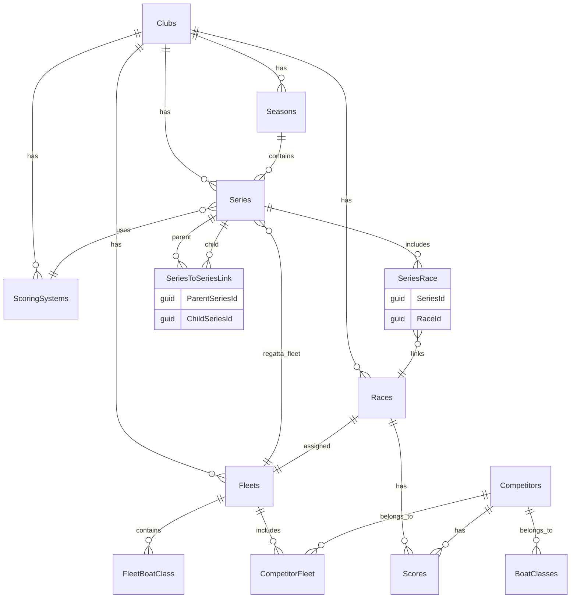

# SailScores Database Schema

This document provides a detailed reference for the SailScores database schema. This information is used by developers and AI assistants to understand the data model when working on the application.

## Summary Entity Relationship Diagram



## Table Definitions

### Series
Represents a series of races that are scored together.

| Column | Type | Constraints | Notes |
|--------|------|-----------|-------|
| Id | GUID | PK | Primary key |
| ClubId | GUID | FK (Clubs) | Club that owns this series |
| Name | VARCHAR(200) | NOT NULL | Series name |
| UrlName | VARCHAR(200) | | URL-friendly name |
| Description | VARCHAR(2000) | | Series description |
| Type | INT (enum) | | Standard, Summary, or Regatta |
| SeasonId | GUID | FK (Seasons) | Season this series belongs to |
| ScoringSystemId | GUID | FK (ScoringSystems), nullable | Scoring system to use (null = default) |
| FleetId | GUID | FK (Fleets), nullable | Fleet associated with regatta series |
| ResultsLocked | BIT | | Whether results are locked from editing |
| IsImportantSeries | BIT | | Marked as important |
| ExcludeFromCompetitorStats | BIT | | Excluded from individual competitor statistics |
| TrendOption | INT (enum) | | Trend calculation option |
| PreferAlternativeSailNumbers | BIT | | Use alternative sail numbers for display |
| UpdatedDateUtc | DATETIME | | Last update timestamp (UTC) |
| UpdatedBy | VARCHAR(128) | | User who last updated |

**Relationships:**
- Has many `SeriesRace` records (races in this series)
- Has many `SeriesToSeriesLink` as parent (if summary series)
- Has many `SeriesToSeriesLink` as child (if child of summary series)

---

### Races
Individual race events within a series.

| Column | Type | Constraints | Notes |
|--------|------|-----------|-------|
| Id | GUID | PK | Primary key |
| ClubId | GUID | FK (Clubs) | Club that owns this race |
| Name | VARCHAR(200) | | Race name/identifier |
| Date | DATETIME | | Race date |
| State | VARCHAR(30) (enum) | | Pending, Completed, Abandoned, etc. |
| Order | INT | | Display order for races on same date |
| Description | VARCHAR(1000) | | Race description |
| TrackingUrl | VARCHAR(500) | | URL for live tracking |
| FleetId | GUID | FK (Fleets) | **Fleet assigned to this race** |
| StartTime | DATETIME | nullable | Race start time |
| TrackTimes | BIT | | Whether to track times |
| UpdatedDateUtc | DATETIME | | Last update timestamp (UTC) |
| UpdatedBy | VARCHAR(128) | | User who last updated |

**Relationships:**
- Belongs to one `Fleets` record
- Has many `SeriesRace` records (which series it belongs to)
- Has many `Scores` records (competitor scores)

**Important:** Each race is assigned to exactly one fleet (via `FleetId`). A series can contain races from multiple fleets.

---

### SeriesRace (Junction Table)
Many-to-many relationship between Series and Races.

| Column | Type | Constraints | Notes |
|--------|------|-----------|-------|
| SeriesId | GUID | FK (Series), PK part | Series identifier |
| RaceId | GUID | FK (Races), PK part | Race identifier |

**Key Notes:**
- This is the junction table that links races to series
- Do not query `Races` directly from `Series`; always use `SeriesRace` junction table to maintain referential integrity
- A single race can belong to multiple series
- Enables flexible series composition

---

### Fleet
A group of competitors that are scored together.

| Column | Type | Constraints | Notes |
|--------|------|-----------|-------|
| Id | GUID | PK | Primary key |
| ClubId | GUID | FK (Clubs) | Club that owns this fleet |
| Name | VARCHAR(200) | | Fleet name (e.g., "Cruising Class") |
| ShortName | VARCHAR(30) | | Short name for display |
| NickName | VARCHAR(30) | | Nickname for the fleet |
| Description | VARCHAR(2000) | | Fleet description |
| FleetType | INT (enum) | | Fleet type classification |
| IsHidden | BIT | | Hide from public fleet lists |
| IsActive | BIT | | Active/inactive flag |

**Relationships:**
- Has many `Races` records (races assigned to this fleet)
- Has many `FleetBoatClass` records (boat classes in fleet)
- Has many `CompetitorFleet` records (competitors in fleet)

---

### Season
A time period (typically a sailing season) that contains series.

| Column | Type | Constraints | Notes |
|--------|------|-----------|-------|
| Id | GUID | PK | Primary key |
| ClubId | GUID | FK (Clubs) | Club that owns this season |
| Name | VARCHAR(200) | | Season name (e.g., "2024 Spring") |
| Start | DATETIME | | Season start date |
| End | DATETIME | | Season end date |

**Relationships:**
- Has many `Series` records

---

### SeriesToSeriesLink (Self-Referential)
Enables hierarchical series relationships (summary series containing child series).

| Column | Type | Constraints | Notes |
|--------|------|-----------|-------|
| ParentSeriesId | GUID | FK (Series), PK part | Parent series identifier |
| ChildSeriesId | GUID | FK (Series), PK part | Child series identifier |

**Key Notes:**
- Used for summary series: a summary series (parent) contains standard series (children)
- The `Series.Type` column indicates if a series is Standard, Summary, or Regatta
- A summary series can have many children
- A standard series can have at most one parent (in practice)

---

### Club
The top-level organization that owns all other entities.

| Column | Type | Constraints | Notes |
|--------|------|-----------|-------|
| Id | GUID | PK | Primary key |
| Name | VARCHAR(200) | NOT NULL | Club name |
| Initials | VARCHAR(10) | UNIQUE | Short identifier (e.g., "BAYSC") |
| Website | VARCHAR(500) | | Club website URL |
| Location | VARCHAR(200) | | Club location |

**Relationships:**
- Has many `Seasons` records
- Has many `Series` records
- Has many `Fleets` records
- Has many `Races` records
- Has many `ScoringSystems` records

---

### ScoringSystem
Defines how races are scored.

| Column | Type | Constraints | Notes |
|--------|------|-----------|-------|
| Id | GUID | PK | Primary key |
| ClubId | GUID | FK (Clubs) | Club that owns this scoring system |
| Name | VARCHAR(200) | NOT NULL | System name (e.g., "Low Point", "High Point Percentage") |
| Description | VARCHAR(2000) | | System description |
| IsDefault | BIT | | Whether this is the default system |

**Relationships:**
- Has many `Series` records (series that use this scoring system)

---

### Score
Individual competitor scores in a race.

| Column | Type | Constraints | Notes |
|--------|------|-----------|-------|
| Id | GUID | PK | Primary key |
| RaceId | GUID | FK (Races) | Race this score is for |
| CompetitorId | GUID | FK (Competitors) | Competitor who scored |
| ScoreValue | DECIMAL | | Numeric score |
| IsDiscard | BIT | | Whether this score is discarded from series totals |
| PlaceRaw | INT | | Raw placement (1st, 2nd, etc.) |
| CodeId | GUID | FK (ScoreCode) | Penalty/status code |

**Relationships:**
- Belongs to one `Races` record
- Belongs to one `Competitors` record
- References a `ScoreCodes` record (if applicable)

---

### CompetitorFleet
Many-to-many relationship between Competitors and Fleets.

| Column | Type | Constraints | Notes |
|--------|------|-----------|-------|
| CompetitorId | GUID | FK (Competitors), PK part | Competitor identifier |
| FleetId | GUID | FK (Fleets), PK part | Fleet identifier |

**Key Notes:**
- Enables a competitor to race in multiple fleets

---

### FleetBoatClass
Associates boat classes with fleets.

| Column | Type | Constraints | Notes |
|--------|------|-----------|-------|
| FleetId | GUID | FK (Fleets), PK part | Fleet identifier |
| BoatClassId | GUID | FK (BoatClasses), PK part | Boat class identifier |

---

## Key Relationships Diagram

```
Clubs
 ├── Seasons
 │    └── Series (contains races via SeriesRace junction table)
 │         ├── SeriesRace (junction table)
 │         │    └── Races → Fleets
 │         └── SeriesToSeriesLink (for summary series)
 │
 ├── Fleets
 │    └── Races (assigned to exactly one fleet)
 │
 └── ScoringSystems
      └── Series (optional scoring system)
```

## Multi-Fleet Series

A single series can contain races assigned to different fleets. This is important to understand:

- Each `Races` record has exactly one `FleetId`
- A `Series` contains many `Races` records via the `SeriesRace` junction table
- Therefore, a series can have races from multiple fleets

## Enum Types

### SeriesType
Categorizes the type of series.

| Value | Name | Description |
|-------|------|-------------|
| 0 | Standard | Regular series with individual races |
| 1 | Summary | Aggregates scores from child series |
| 2 | Regatta | Special regatta format series |

### RaceState
Indicates the state of a race.

| Value | Name | Description |
|-------|------|-------------|
| | Pending | Race not yet completed |
| | Completed | Race results are finalized |
| | Abandoned | Race was cancelled/abandoned |
| | NoWind | Race cancelled due to no wind |
| | PostponedBad | Race postponed due to bad conditions |
| | PostponedEquipment | Race postponed due to equipment issues |

### FleetType
Categorizes the type of fleet.

| Value | Name | Description |
|-------|------|-------------|
| 0 | Standard | General fleet |
| 1 | Cruising | Cruising class fleet |
| 2 | Racing | Racing class fleet |
| 3 | OneDesign | One design class fleet |

### TrendOption
Determines how trend lines are calculated for series displays.

| Value | Name | Description |
|-------|------|-------------|
| 0 | ThreeRaceMoving | Three-race moving average |
| 1 | Linear | Linear regression trend |
| 2 | None | No trend calculation |

## Validation & Constraints

### Date Constraints
- **Season**: `Start` date must be before or equal to `End` date
- **Series with DateRestricted**: `EnforcedStartDate` and `EnforcedEndDate` must fall within the `Season` date range
- **Race**: `Date` should typically fall within its parent `Series` date range (enforced at application level)

### Uniqueness Constraints
- `Club.Initials` is globally unique (natural key)
- `Season.Name` + `Club.Id` combination is typically unique (season names per club)
- `Fleet.Name` + `Club.Id` combination is typically unique (fleet names per club)
- `Series.Name` + `Season.Id` combination is typically unique (series names per season)

### Foreign Key Constraints
- Series with non-null `FleetId` typically have `Type = Regatta`
- Races must belong to exactly one Fleet (non-nullable `FleetId`)
- Series must belong to exactly one Season (non-nullable `SeasonId`)

### Business Rules
- A Series can contain races from **multiple different Fleets** (this is possible and valid)
- A Summary Series must have at least one child series
- A Standard Series can be a child of at most one Summary Series
- Discarded scores are still recorded but excluded from calculations via the `IsDiscard` flag

## Common Query Patterns

### Find Series with Multiple Fleets
```sql
SELECT 
    s.Id,
    s.Name AS SeriesName,
    COUNT(DISTINCT r.FleetId) AS FleetCount,
    COUNT(sr.RaceId) AS RaceCount
FROM Series s
LEFT JOIN SeriesRace sr ON s.Id = sr.SeriesId
LEFT JOIN Races r ON sr.RaceId = r.Id
GROUP BY s.Id, s.Name
HAVING COUNT(DISTINCT r.FleetId) > 1
ORDER BY FleetCount DESC, s.Name
```

### Get All Races in a Series with Fleet Information
```sql
SELECT 
    r.Id,
    r.Name,
    r.Date,
    f.Name AS FleetName,
    r.State
FROM SeriesRace sr
INNER JOIN Races r ON sr.RaceId = r.Id
LEFT JOIN Fleets f ON r.FleetId = f.Id
WHERE sr.SeriesId = @SeriesId
ORDER BY r.Date, r.Order
```

### Find Active Competitors in a Fleet
```sql
SELECT DISTINCT 
    c.Id,
    c.Name
FROM CompetitorFleet cf
INNER JOIN Competitors c ON cf.CompetitorId = c.Id
INNER JOIN Fleets f ON cf.FleetId = f.Id
WHERE f.Id = @FleetId
  AND c.IsActive = 1
ORDER BY c.Name
```

### Get Series Hierarchy (Summary → Standard)
```sql
SELECT 
    p.Id AS ParentSeriesId,
    p.Name AS ParentSeriesName,
    c.Id AS ChildSeriesId,
    c.Name AS ChildSeriesName
FROM SeriesToSeriesLink stsl
INNER JOIN Series p ON stsl.ParentSeriesId = p.Id
INNER JOIN Series c ON stsl.ChildSeriesId = c.Id
WHERE p.ClubId = @ClubId
ORDER BY p.Name, c.Name
```

### Calculate Total Races per Series by Fleet
```sql
SELECT 
    s.Id,
    s.Name AS SeriesName,
    f.Name AS FleetName,
    COUNT(sr.RaceId) AS RaceCount
FROM Series s
LEFT JOIN SeriesRace sr ON s.Id = sr.SeriesId
LEFT JOIN Races r ON sr.RaceId = r.Id
LEFT JOIN Fleets f ON r.FleetId = f.Id
GROUP BY s.Id, s.Name, f.Id, f.Name
ORDER BY s.Name, f.Name
```

## Schema Validation Query

Run this query periodically to validate your schema documentation. It returns actual column information:

```sql
-- Validate key tables exist and show their column counts
SELECT 
    TABLE_NAME,
    COUNT(*) AS ColumnCount,
    COUNT(CASE WHEN IS_NULLABLE = 'NO' THEN 1 END) AS RequiredColumns
FROM INFORMATION_SCHEMA.COLUMNS
WHERE TABLE_SCHEMA = 'dbo'
  AND TABLE_NAME IN ('Series', 'Races', 'Fleets', 'Seasons', 'SeriesRace', 
                     'SeriesToSeriesLink', 'Clubs', 'ScoringSystems', 'Scores')
GROUP BY TABLE_NAME
ORDER BY TABLE_NAME

-- List all foreign keys
SELECT 
    KCU1.CONSTRAINT_NAME,
    KCU1.TABLE_NAME,
    KCU1.COLUMN_NAME,
    KCU2.TABLE_NAME AS ReferencedTable,
    KCU2.COLUMN_NAME AS ReferencedColumn
FROM INFORMATION_SCHEMA.REFERENTIAL_CONSTRAINTS RC
INNER JOIN INFORMATION_SCHEMA.KEY_COLUMN_USAGE KCU1 
    ON RC.CONSTRAINT_NAME = KCU1.CONSTRAINT_NAME
INNER JOIN INFORMATION_SCHEMA.KEY_COLUMN_USAGE KCU2 
    ON RC.UNIQUE_CONSTRAINT_NAME = KCU2.CONSTRAINT_NAME
WHERE KCU1.TABLE_SCHEMA = 'dbo'
ORDER BY KCU1.TABLE_NAME, KCU1.CONSTRAINT_NAME
```

## Entity Framework Models

The C# entity models are located in `SailScores.Database/Entities/`:
- `Series.cs`
- `Race.cs`
- `Fleet.cs`
- `Season.cs`
- `SeriesRace.cs`
- `SeriesToSeriesLink.cs`

These models are the source of truth for the database schema in EF Core.

## Migrations

Database schema changes are managed through EF Core migrations:
- Location: `SailScores.Database/Migrations/`
- Always use `dotnet ef migrations add` to create new migrations
- Never manually edit `.Designer.cs` or snapshot files

Example:
```bash
dotnet ef migrations add AddSeriesFleetFeature --project SailScores.Database --startup-project SailScores.Web --context SailScoresContext
```
