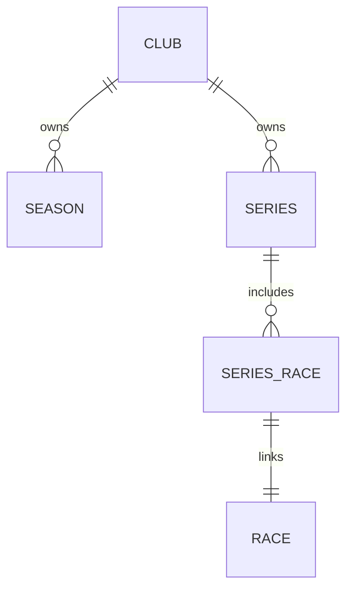

# DatabaseSchema.md Enhancements

This document summarizes the improvements made to `docs/DatabaseSchema.md` to provide more complete and actionable database schema documentation.

## What Was Added

### 1. Mermaid ER Diagram
**Location**: Top of the document

A visual Entity Relationship Diagram showing:
- All major tables and their relationships
- Cardinality (one-to-many, many-to-many)
- Junction tables and their columns
- Key flows like Club → Season → Series → Races

**Example**:


**Benefits**:
- Quick visual understanding of database structure
- Easy to understand relationships at a glance
- Useful for onboarding new developers
- Renders in GitHub, Azure DevOps, and most markdown viewers

---

### 2. Additional Table Definitions

Expanded coverage to include referenced tables that were missing:

#### Club (Top-level organization)
- Primary key, initials, website, location
- All other tables ultimately belong to a club

#### ScoringSystem (Scoring configuration)
- Used by Series to define scoring rules
- Can be marked as default
- Referenced by Series

#### Score (Individual race scores)
- Competitor scores in each race
- Includes discard flags
- References penalty codes

#### CompetitorFleet (Many-to-many)
- Enables competitors to race in multiple fleets
- Key relationship for multi-fleet support

#### FleetBoatClass (Fleet composition)
- Associates boat classes with fleets

---

### 3. Comprehensive Enum Definitions

Added detailed tables for all enum types:

| Enum | Values | Example |
|------|--------|---------|
| SeriesType | Standard, Summary, Regatta | Defines series behavior |
| RaceState | Pending, Completed, Abandoned, NoWind, PostponedBad, PostponedEquipment | Race status |
| FleetType | Standard, Cruising, Racing, OneDesign | Fleet classification |
| TrendOption | ThreeRaceMoving, Linear, None | Chart trend calculation |

---

### 4. Validation & Constraints Section

Detailed business rules and database constraints:

- **Date Constraints**: Season dates, series date restrictions, race dates
- **Uniqueness Constraints**: Club initials, season/fleet names, series names
- **Foreign Key Constraints**: Required relationships and nullable fields
- **Business Rules**: Multi-fleet series, summary series composition, discard handling

**Example**:
> A Series can contain races from multiple different Fleets (this is possible and valid)

---

### 5. Common Query Patterns

Five pre-built SQL queries for frequent operations:

1. **Find Series with Multiple Fleets**
   - Identifies which series span multiple fleets
   - Useful for planning "Default Fleet" feature impact

2. **Get All Races in a Series with Fleet Information**
   - Common query for series detail views
   - Shows parameterized usage pattern

3. **Find Active Competitors in a Fleet**
   - Typical competitor listing query
   - Demonstrates joining with active flags

4. **Get Series Hierarchy (Summary → Standard)**
   - Supports summary series navigation
   - Shows self-referential relationship usage

5. **Calculate Total Races per Series by Fleet**
   - Aggregation and grouping example
   - Useful for series statistics

**Benefits**:
- Copy-paste ready for common tasks
- Reference patterns for new queries
- Validate relationships through SQL
- Examples for new developers

---

### 6. Schema Validation Query

Two automated validation queries that reference the actual database:

**Query 1**: Validates table structure
```sql
SELECT TABLE_NAME, ColumnCount, RequiredColumns
FROM INFORMATION_SCHEMA.COLUMNS
WHERE TABLE_NAME IN ('Series', 'Races', 'Fleet', ...)
```
- Returns actual column counts per table
- Shows required vs. nullable columns
- Can be run periodically to verify documentation accuracy

**Query 2**: Lists all foreign keys
```sql
SELECT CONSTRAINT_NAME, TABLE_NAME, COLUMN_NAME, 
       ReferencedTable, ReferencedColumn
FROM INFORMATION_SCHEMA.REFERENTIAL_CONSTRAINTS
```
- Automatically discovers all relationships
- Can detect schema drift from documentation
- Useful for code generation and validation

**Purpose**:
- Keep documentation synchronized with actual schema
- Detect schema changes automatically
- Validate documentation completeness
- Can be integrated into build/deployment pipelines

---

## How to Use These Enhancements

### For Development
1. **Visual Understanding**: Use the Mermaid ER diagram when learning the schema
2. **Copy-Paste Queries**: Use the Common Query Patterns section as templates
3. **Relationship Discovery**: Check Additional Table Definitions when adding features
4. **Constraint Checking**: Reference Validation & Constraints before data model changes

### For Maintenance
1. **Keep Current**: Run the validation queries quarterly
2. **Document Changes**: Update Enum Definitions when adding new enum values
3. **Add Examples**: Add new Common Query Patterns as you discover useful patterns
4. **Update Diagram**: Edit the Mermaid diagram when adding new tables

### For AI Assistance (Copilot)
1. Mermaid diagram provides visual context for relationship questions
2. Common Query Patterns show idiomatic SQL for this database
3. Enum Definitions prevent AI from guessing invalid values
4. Business Rules clarify non-obvious constraints (e.g., multi-fleet series)

---

## Future Enhancements

Consider adding:
- **Views/Materialized Views**: Document any database views
- **Stored Procedures**: If any exist, document their purposes
- **Computed Columns**: Document calculated fields
- **Performance Notes**: Indexes, query optimization tips
- **Data Migration Guide**: For schema version upgrades
- **ER Diagram Variants**: Separate diagrams for different concerns (scoring, fleet management, etc.)
- **Data Example Scenarios**: Sample data setups for common use cases

---

## Related Files

- `.github/copilot-instructions.md` - References this schema document
- `SailScores.Database/Entities/` - C# model source of truth
- `SailScores.Database/Migrations/` - Schema change history
- `docs/Development.md` - General development guide
